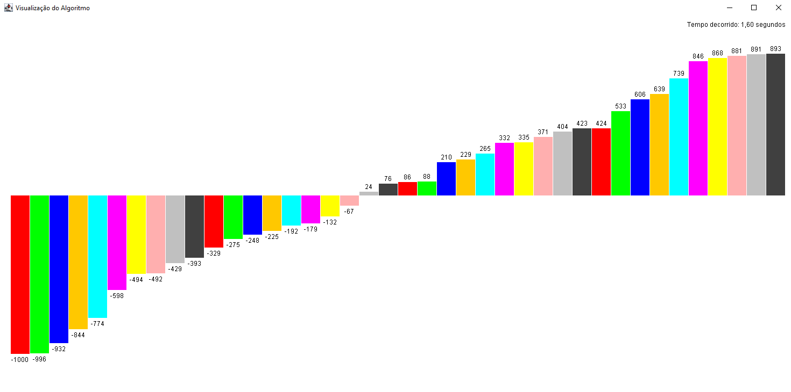

# 📊Sorting Algorithm Visualizer

A Java-based application that visualizes the execution of sorting algorithms using a graphical user interface built with Java Swing. This tool helps in understanding and analyzing various sorting algorithms in action.



## Features

- **Sorting Algorithms**: Bubble Sort, Insertion Sort, Selection Sort
- **Data Types Supported**: Integers, Characters
- **Sorting Order**: Ascending (AZ), Descending (ZA)
- **Data Input Methods**: Randomly generated data, User-provided data via command line
- **Visualization**: Graphical representation of sorting steps with labels

## Requirements

- Java 8 or higher

## Installation

1. **Clone the repository**:
    ```bash
    git clone https://github.com/imfeear/Sort-Algorithm.git
    ```
2. **Navigate to the project directory**:
    ```bash
    cd Sort-Algorithm
    ```
3. **Compile the project**:
    ```bash
    javac -d bin src/*.java
    ```
4. **Run the application**:
    ```bash
    java -cp bin Algorithm [options]
    ```

## Usage

Run the application with command-line arguments to configure the sorting process:

```bash
java -cp bin Algorithm [options]
```
## Command-Line Options

**a: Sorting algorithm (bubble, insertion, selection)**

**t: Data type (n for numbers, c for characters)**

**o: Sorting order (AZ for ascending, ZA for descending)**

**in: Data input method (r for random data, m for user-provided data)**

**s: Pause interval in milliseconds between sorting steps**

**l: Size of the data to be sorted**

**v: User-provided data values (comma-separated, required if in=m)**

## Example Usage

**Sort 50 random numbers in ascending order with a 500 ms pause between each step:**
```bash
java -cp bin Algorithm a=b t=n o=AZ in=r s=500 l=50
```
**Sort user-provided characters in descending order with a 300 ms pause:**
```bash
java -cp bin Algorithm a=i t=c o=ZA in=m v=a,b,c,d,e,f s=300 l=10
```
## Project Structure

**'src/Sorts/': Contains sorting algorithm implementations ('BubbleSort', 'InsertionSort', 'SelectionSort').**

**'src/Panel/': Contains the graphical panel class ('SortingPanel').**

**'src/TratamentoArgs/': Contains command-line argument processing ('ArgumentProcessor').**

**'src/Algorithm.java': Main class to start the application.**

## Contributing

### *Contributions are welcome! Please follow these steps to contribute:*

**1. Fork the repository.**

**2. Create a new branch (git checkout -b feature/new-feature).**

**3. Commit your changes (git commit -am 'Add new feature').**

**4. Push to the branch (git push origin feature/new-feature).**

**5. Open a Pull Request on GitHub.**

## Contact

### 📛**Name:** *Bruno Reis*


### 📧Email: *reeiskkz@gmail.com*

### ☕**Java Version:** *22*


